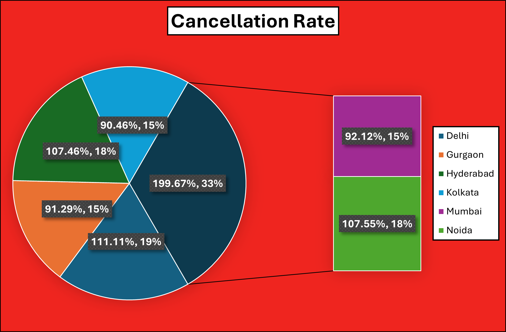
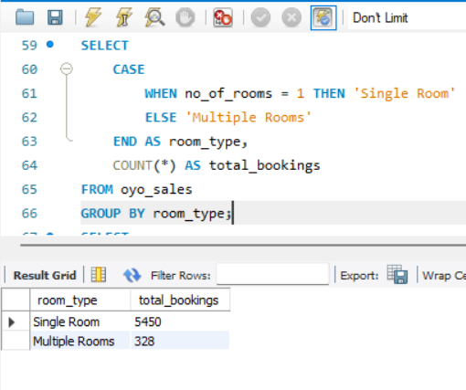
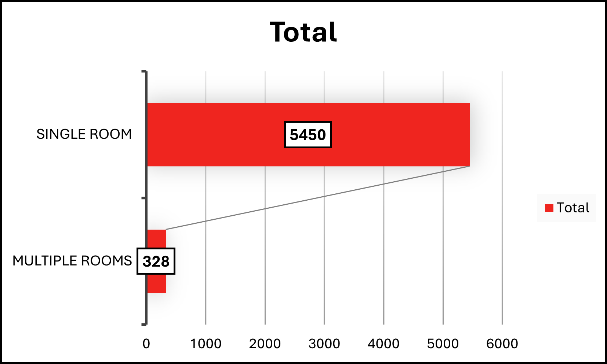
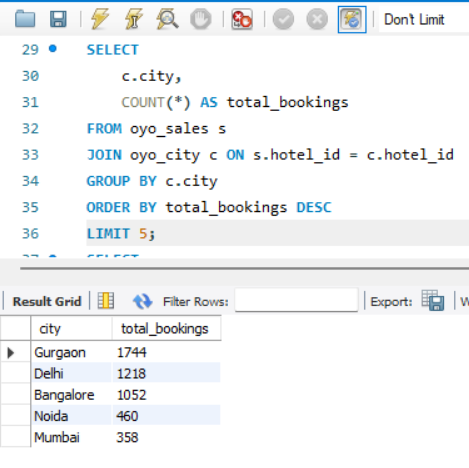
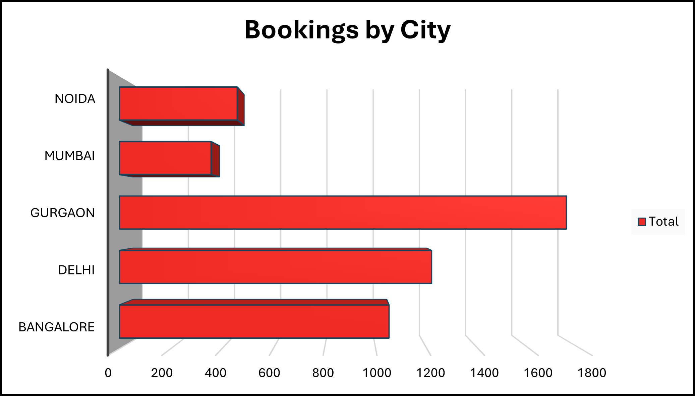
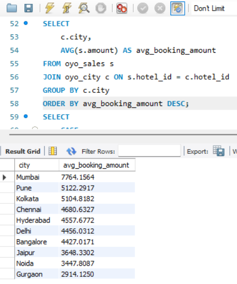
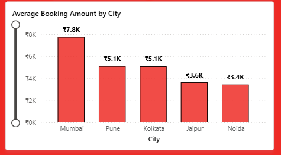
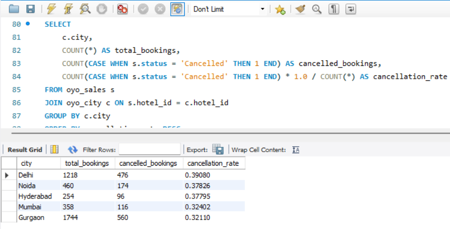
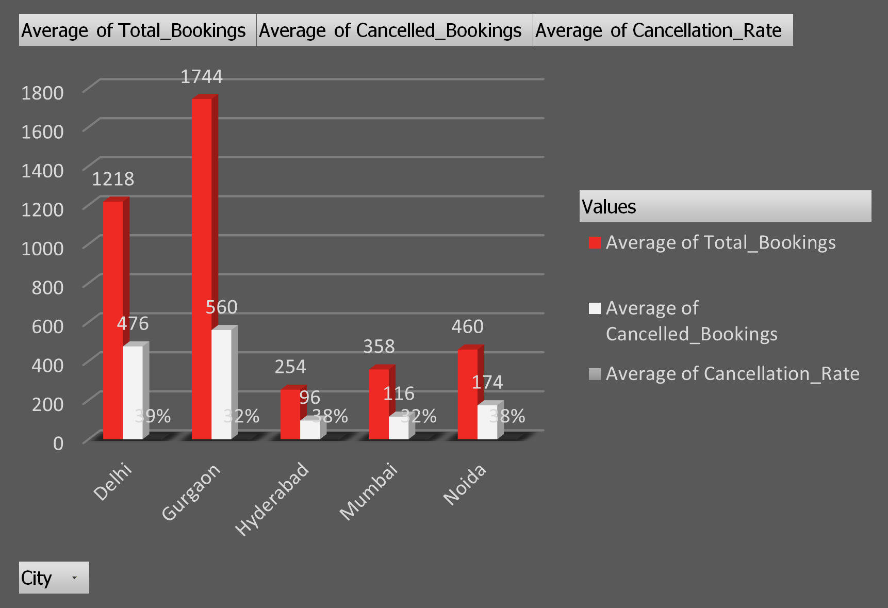

# OYO-Hospitality-Analysis
An end-to-end data analysis project focused on hospitality performance, identifying booking trends, revenue drivers, and cancellation patterns across 10 major cities.
OYO Hospitality Dashboard
OYO Rooms, or OYO originally known as OYO Hotels & houses, is an Indian international hospitality business owned by PRISM that operates both leased and franchised hotels, houses, and living spaces. It is headquartered in Gurgaon, Haryana. Ritesh Agarwal founded OYO in 2012, and it began with a focus on affordable hotels. As of January 2020, it operated over 43,000 hotels and 1 million rooms in 800 locations across 80 countries. This project focusses on an end-to-end data analysis project focused on hospitality performance, identifying booking trends, and cancellation patterns across 10 major cities.

----------------------------------------------------------------------------------------------------------------------------------------------------------------------------------------------------------------------------------------------
## - **Project Methodology:**

Identifying the Problem: I analyzed hospitality datasets to understand the drivers behind revenue fluctuations and booking cancellations across different urban markets. I focused on identifying high-value cities and analyzing the demand for different room categories to optimize property performance.

Data Cleaning and Processing: I utilized SQL for initial data extraction and aggregation. In Excel, I performed data transformation by standardizing city names, handling null values in booking amounts, and using VLOOKUP to map property IDs to their respective locations.

Exploratory Data Analysis (EDA): I created summary tables to calculate the Realization Rate (Successful Check-ins vs. Total Bookings) and determined the Average Booking Amount across 10 distinct cities.

Data Visualization: I developed specialized charts in Power BI, including a Funnel Chart for booking volume by city and a Donut Chart to visualize the massive 94% market share held by Single Rooms.

Enhanced Formatting: To maintain brand consistency, I applied OYO’s signature red-and-white color palette across all visuals and used the Format Painter to ensure a uniform, professional design throughout the report.

Dashboard Creation: I designed an interactive command center that integrates Gauge Charts for KPI tracking (Total Bookings and Cancellation Rates) and Slicers for City and Month, allowing stakeholders to drill down into specific regional performance.

----------------------------------------------------------------------------------------------------------------------------------------------------------------------------------------------------------------------------------------------
## - **Project KPI:**

In this project, I analyzed 5,778 bookings across 10 cities to monitor a ₹5.12K average booking value and a 32.04% cancellation rate. These KPIs help identify revenue-rich markets like Mumbai and high-attrition zones like Noida to optimize OYO's operational efficiency.

---------------------------------------------------------------------------------------------------------------------------------------------------------------------------------------------------------------------------------------------
## - 🛠️ **Tech Stack:**

**SQL**: Used for complex querying to extract and aggregate booking data from the primary database.

**Excel**: Performed data cleaning, handled missing values, and conducted initial data transformations.

**Power BI**: Built an interactive dashboard featuring custom DAX measures, advanced filtering, and a unified brand-specific UI.

---------------------------------------------------------------------------------------------------------------------------------------------------------------------------------------------------------------------------------------------
## - **Important Highlights derived from the Project:**

1. Cancellation rates of different cities
   
2. How many bookings were for single rooms vs. multiple rooms?
   
3. Number of bookings of different cities
   
4. What is the average booking amount per city?
   
5. How do bookings distribute across different cities in case of bookings of total and cancellation along with cancellation rates?
   
----------------------------------------------------------------------------------------------------------------------------------------------------------------------------------------------------------------------------------------------
## - **Key Insights and Highlights:**

1. Mumbai (33% share, 199.67%) – Major driver of cancellations; requires urgent intervention.
   
	  • Kolkata (19% share, 111.11%) – Second-highest contributor; signals regional service issues.
   
    • Hyderabad & Gurgaon (15–18% share, ~91–107%) – Mid-range but notable; worth monitoring for trends.

	  • Delhi (15% share, 90.46%) – Lowest rate; potential benchmark for best practices.
   
	  • Noida (18% share, 107.55%) – Higher than Delhi; suggests localized inefficiencies.

2. Single Rooms (5450 avg) – Core revenue driver and dominant preference and Multiple Rooms (328 avg) – Low demand and comes under niche category.
   
   •	Imbalance – Large gap highlights focus on single-room strategy.
   
   •	Implication – Promote multiple rooms or optimize single-room offerings.

3. Gurgaon – Highest bookings and a offers a key demand hub, while Delhi has Strong second with steady performance. Then it is followed by Bangalore with Moderate demand and offers a mid-tier market.
   
  •	Noida – Lower bookings, smaller share.
  
  •	Mumbai – Lowest bookings, underperforming city.

  

  

4. Mumbai drives premium bookings, while Jaipur and Noida need strategies to lift booking values.
   
   • Mumbai (₹7.8K) – Highest average booking amount, clear revenue leader.
   
   • Pune & Kolkata (₹5.1K each) – Mid-range, steady contributors.
   
   • Jaipur (₹3.6K) & Noida (₹3.4K) – Lowest averages, weaker markets.  

5. Gurgaon and Mumbai serve as benchmarks for resilience and retention. Delhi and Hyderabad require targeted interventions to reduce cancellations, while Noida needs balanced growth and retention strategies.

    • Gurgaon: Strongest performer with the highest bookings (1,744) and a relatively controlled cancellation rate (32%).

    • Delhi: High booking volume (1,218) but also the highest cancellations (476).
   
    • Hyderabad: Moderate bookings (560) but the highest cancellation rate (45%).

    • Mumbai: Lowest bookings (358) but the best cancellation rate (28%).

    • Noida: Mid‑range bookings (460) with a high cancellation rate (38%).
   

--------------------------------------------------------------------------------------------------------------------------------------------------------------------------------------------------------------------------------------------
## - **Key Learnings:**

The primary objevctive was to develop a hospitality management and revenue optimization dashboard that tracks business health across 10 cities, focusing on identifying revenue leakage through cancellation trends and room-type demand.I learned to identify critical revenue leakage, such as the 32% cancellation rate, and leverage SQL and Power BI to pinpoint high-value markets like Mumbai for targeted business growth. I also mastered the end-to-end workflow of transforming raw hospitality data into actionable insights through rigorous cleaning and KPI development.

--------------------------------------------------------------------------------------------------------------------------------------------------------------------------------------------------------------------------------------------
## - **Author:**
• @pradhansnehashish5-dev

• Snehashish Pradhan - Data Analyst
