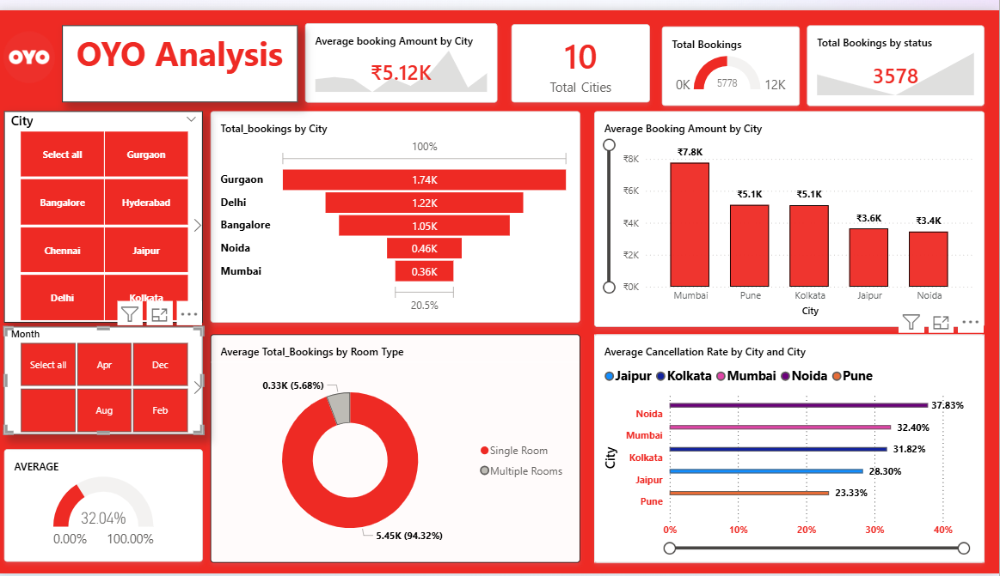

# OYO-Hospitality-Analysis
An end-to-end data analysis project focused on hospitality performance, identifying booking trends, revenue drivers, and cancellation patterns across 10 major cities.
OYO Hospitality Dashboard
OYO Rooms, or OYO originally known as OYO Hotels & houses, is an Indian international hospitality business owned by PRISM that operates both leased and franchised hotels, houses, and living spaces. It is headquartered in Gurgaon, Haryana. Ritesh Agarwal founded OYO in 2012, and it began with a focus on affordable hotels. As of January 2020, it operated over 43,000 hotels and 1 million rooms in 800 locations across 80 countries. This project focusses on an end-to-end data analysis project focused on hospitality performance, identifying booking trends, and cancellation patterns across 10 major cities.

-------------------------------------------------------------------------------------------------------------------------------------------------------------------------------------------------------------------------------------------------
## - **Project Methodology:**

Identifying the Problem: I analyzed hospitality datasets to understand the drivers behind revenue fluctuations and booking cancellations across different urban markets. I focused on identifying high-value cities and analyzing the demand for different room categories to optimize property performance.

Data Cleaning and Processing: I utilized SQL for initial data extraction and aggregation. In Excel, I performed data transformation by standardizing city names, handling null values in booking amounts, and using VLOOKUP to map property IDs to their respective locations.

Exploratory Data Analysis (EDA): I created summary tables to calculate the Realization Rate (Successful Check-ins vs. Total Bookings) and determined the Average Booking Amount across 10 distinct cities.

Data Visualization: I developed specialized charts in Power BI, including a Funnel Chart for booking volume by city and a Donut Chart to visualize the massive 94% market share held by Single Rooms.

Enhanced Formatting: To maintain brand consistency, I applied OYO’s signature red-and-white color palette across all visuals and used the Format Painter to ensure a uniform, professional design throughout the report.

Dashboard Creation: I designed an interactive command center that integrates Gauge Charts for KPI tracking (Total Bookings and Cancellation Rates) and Slicers for City and Month, allowing stakeholders to drill down into specific regional performance.
------------------------------------------------------------------------------------------------------------------------------------------------------------------------------------------------------------------------------------------------
## = **Project KPI:**

In this project, I analyzed 5,778 bookings across 10 cities to monitor a ₹5.12K average booking value and a 32.04% cancellation rate. These KPIs help identify revenue-rich markets like Mumbai and high-attrition zones like Noida to optimize OYO's operational efficiency.

